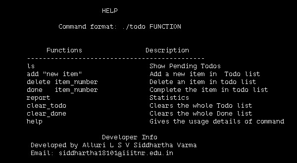

# Todo CLI using Python
> A python command line tool for making and maintaining todo list.

## Instructions to use
1. Clone the Repo
2. In the terminal of the repo, run the command `ln -s todo.sh todo`
3. Run the command `./todo help` to get all the instruction on how to use.
4. I have attached a snapshot of it for the comfort of the reader

*Note:* I wrote this code as a part of a selection process for coronasafe engineering fellowship. 

### Thank You
